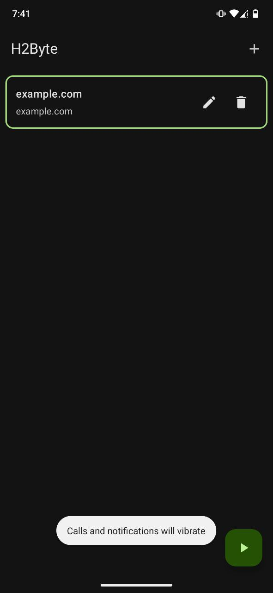
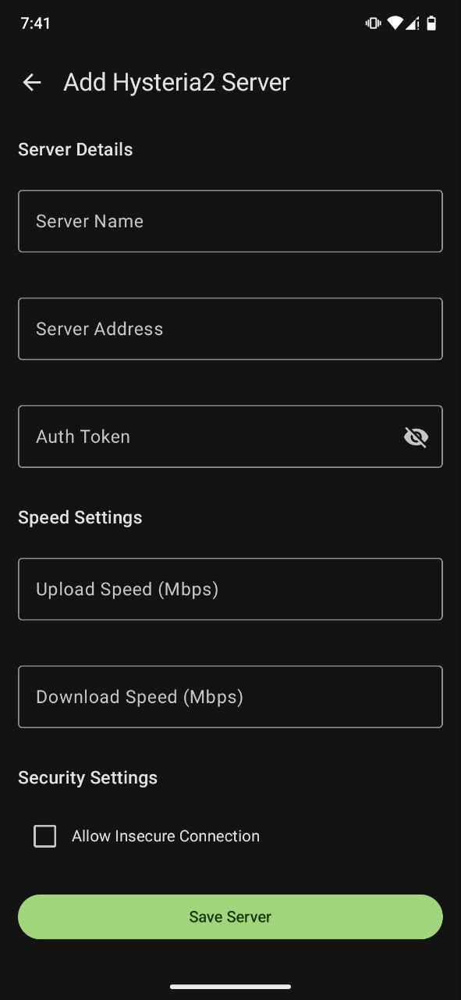

# H2Byte

H2Byte is an Android client for Hysteria2, a powerful, lightning-fast, and censorship-resistant proxy protocol. This project is brought to you by The Byte Array, a non-profit open-source organization.

## About

H2Byte is developed by Tamim Hossain, Founder and Lead Developer of The Byte Array. This project aims to provide a seamless and efficient VPN experience on Android devices using the Hysteria2 protocol.

## Packet Flow

The following diagram illustrates how packets flow through the H2Byte application:

```
+------------+       +------------+       +------------+       +------------+       +------------------+
|   TUN      |------>|  tun2socks |------>|   SOCKS    |------>|  Hysteria  |------>|  Remote Server   |
|  Interface |       |  Process   |       |  Proxy     |       |  Tunnel    |       |  (e.g., Server)  |
+------------+       +------------+       +------------+       +------------+       +------------------+
     ^                    |                    |                   |                    |
     |                    |                    |                   |                    |
     |                    |                    |                   |                    |
     +--------------------+--------------------+-------------------+--------------------+
```

## Screenshots

<table>
<tr>
<td></td>
<td></td>
</tr>
</table>

## Core Development

This project uses the core implementation from [hysteria2-mobile](https://github.com/TheByteArray/hysteria2-mobile) as its foundation.

## License

This project is licensed under the MIT License - see the [LICENSE](LICENSE) file for details.
